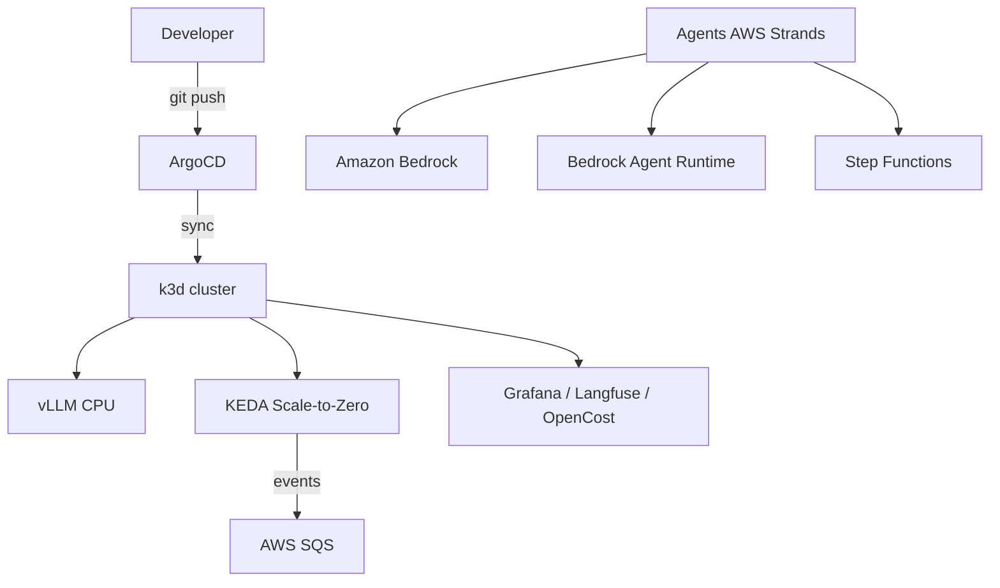

# AIPaaS — AI Platform-as-a-Service

> **Internal Developer Platform (IDP) for deploying and operating AI agents in production.**

This project bridges the gap between AI engineering and cloud-native platform engineering — the defining skillset of an **AI Platform Engineer**. It demonstrates serving LLMs with event-driven autoscaling and cost control, all managed through GitOps.

---

## Architecture

```
Developer
   │  git push (manifests)
   ▼
GitOps Engine (ArgoCD)
   │  automatic sync
   ▼
Kubernetes (k3d local, $0)
   ├── vLLM (CPU) ── private LLM inference
   ├── KEDA ── Scale-to-Zero driven by AWS SQS
   └── Observability: Grafana + Langfuse + OpenCost

AI Agent Engine (AWS)
   ├── Case A: Bedrock Agent Runtime  (autonomous agents, AWS Strands)
   ├── Case B: Step Functions         (auditable sequential flows)
   └── Model: Amazon Bedrock (Claude / etc.)
```

### Mermaid Diagram



---

## Tech Stack

| Domain | Technology |
|--------|-----------|
| GitOps | ArgoCD |
| Cluster | Kubernetes (k3d local) & AWS EKS (prod) |
| Inference | vLLM (CPU mode, Qwen2.5-0.5B) |
| Autoscaling | KEDA (Scale-to-Zero via AWS SQS) |
| Agents | AWS Strands SDK + Amazon Bedrock |
| Orchestration | Bedrock Agent Runtime (Case A) + Step Functions (Case B) |
| Observability | Grafana + Langfuse + OpenCost |
| Progressive Delivery | Argo Rollouts (Canary) |
| MLOps / Continuous Training | MLflow + DVC + Pandera + Ragas + Evidently + Argo Workflows |
| Infrastructure | Terraform + Terragrunt |

---

## Repository Structure

```
aipaas/
├── infra/                        # Infrastructure as Code
│   ├── module/                   # Reusable Terraform modules
│   │   ├── k3d-cluster/          # k3d cluster creation + node labels/taints
│   │   ├── argocd-install/       # ArgoCD Helm installation
│   │   ├── argocd-config/        # ArgoCD project, repos, and parent Application
│   │   ├── vpc/                  # AWS VPC module (for EKS prod)
│   │   ├── vpc-peering/          # VPC peering module
│   │   └── eks/                  # AWS EKS cluster module (managed node groups, IRSA, encryption)
│   └── live/                     # Terragrunt live configurations
│       ├── 001_k3d_init_cluster/  # Step 1: create k3d cluster
│       ├── 002_k3d_argocd_install/ # Step 2: install ArgoCD
│       ├── 003_k3d_argocd_config/  # Step 3: configure ArgoCD (repos, project, parent app)
│       ├── 004_aws_vpc/           # Step 4: AWS VPC (prod)
│       └── 005_aws_eks/           # Step 5: AWS EKS cluster (prod)
├── apps/                         # GitOps-managed application manifests
│   ├── test-nginx/               # Test app (raw manifests)
│   ├── vllm/                     # vLLM inference server (raw manifests)
│   ├── keda/                     # KEDA autoscaler (Helm chart)
│   ├── argo-rollouts/            # Argo Rollouts progressive delivery (Helm chart)
│   ├── prometheus/               # Prometheus monitoring (Helm chart)
│   ├── grafana/                  # Grafana dashboards (Helm chart)
│   ├── opencost/                 # OpenCost FinOps (Helm chart)
│   └── langfuse/                 # Langfuse LLM tracing (Helm chart)
├── agents/                       # Python code for AWS Strands agents
├── docs/                         # Architecture, metrics, failure scenarios
├── notes/                        # Planning and sprint documentation
└── coder-setup/                  # Coder development environment templates
```

---

## GitOps Flow

This project uses a **two-tier App-of-Apps pattern**:

1. **Terraform** creates the k3d cluster, installs ArgoCD, and deploys a single parent Application that points to `apps/` with recursive directory scanning (`*/application.yaml`).
2. **ArgoCD** discovers each `apps/*/application.yaml` file and creates child Applications automatically.
3. Each child Application defines its own source (Helm chart or Git path), sync policy, and namespace.
4. All workloads start at **zero replicas** — scale up individual apps for testing, then scale back to zero.

```
Terraform (Terragrunt)
  └─ creates k3d cluster + installs ArgoCD + creates parent Application
       └─ Parent App scans apps/*/application.yaml
            └─ Child App "vllm"     → renders apps/vllm/deployment.yaml
            └─ Child App "keda"     → pulls Helm chart + inline values
            └─ Child App "grafana"  → pulls Helm chart + inline values
            └─ ... (all apps)
```

**Git is the single source of truth.** All changes are made via Git commits — never via `kubectl apply` or the ArgoCD UI (changes in the UI are reverted by `selfHeal: true`).

---

## Quick Start — Reproduce from Scratch

### Prerequisites

- [Docker](https://docs.docker.com/get-docker/)
- [k3d](https://k3d.io/) v5+
- [kubectl](https://kubernetes.io/docs/tasks/tools/)
- [Helm](https://helm.sh/) v3+
- [Terraform](https://developer.hashicorp.com/terraform/downloads) v1.9+ (cross-variable `validation` blocks)
- [Terragrunt](https://terragrunt.gruntwork.io/) v0.50+

### Step 1 — Clone

```bash
git clone https://github.com/lionelmarcus10/aipaas.git
cd aipaas
```

### Step 2 — Create the cluster

```bash
cd infra/live/001_k3d_init_cluster
terragrunt apply -target k3d_cluster.this
terragrunt apply
```

This creates a k3d cluster with:
- 1 server node (3g RAM, control-plane, tainted for addons only)
- 1 agent node (6g RAM, workloads)
- Local registry for development

### Step 3 — Install ArgoCD

```bash
cd ../002_k3d_argocd_install
terragrunt apply
```

ArgoCD is installed via Helm and waits for all pods to be ready before completing.

### Step 4 — Configure ArgoCD

```bash
cd ../003_k3d_argocd_config
terragrunt apply
```

This creates:
- ArgoCD project `aipaas`
- Helm repository registrations (KEDA, Argo, Grafana, Prometheus, OpenCost, Langfuse)
- Parent Application `aipaas-apps` that recursively discovers all `apps/*/application.yaml`

### Step 5 — Access ArgoCD UI

```bash
kubectl -n argocd port-forward svc/argo-cd-argocd-server 8080:443
```

- URL: https://localhost:8080
- Username: `admin`
- Password: `kubectl -n argocd get secret argocd-initial-admin-secret -o jsonpath="{.data.password}" | base64 -d`

### Step 6 — Scale up an app for testing

Edit any `apps/*/application.yaml` or `apps/*/deployment.yaml` in Git, change replicas from 0 to 1, commit and push:

```bash
git add -A
git commit -m "Scale up test-nginx to 1 replica"
git push
```

ArgoCD will sync within ~3 minutes (default Git poll interval). To force an immediate sync:

```bash
kubectl patch application aipaas-apps -n argocd --type=merge \
  -p='{"metadata":{"annotations":{"argocd.argoproj.io/refresh":"hard"}}}'
```

---

## Applications

| App | Mode | Namespace | Chart | Version | EKS overlay | Status |
|-----|------|-----------|-------|---------|-------------|--------|
| test-nginx | Git path | default | — | — | — | Tested |
| argo-rollouts | Helm | argo-rollouts | argo-rollouts | 2.41.1 | — | Tested |
| grafana | Git path | monitoring | — | — | ✅ gp3 | Tested |
| prometheus | Helm | observability | prometheus | 27.0.0 | — | Tested |
| loki | Git path | monitoring | — | — | ✅ gp3 | Synced |
| promtail | Git path | monitoring | — | — | — | Synced |
| keda | Helm | keda-system | keda | 2.20.1 | — | Tested |
| opencost | Helm | opencost | opencost | 2.5.28 | — | Tested |
| langfuse | Helm | observability | langfuse | 1.5.40 | — | Synced (0 replicas) |
| vllm | Git path | aipaas | — | — | ✅ GPU | Synced (0 replicas) |
| financial-dispute-agent | Git path | financial-dispute-agent | — | — | ✅ ECR+Bedrock+S3Vectors | Synced (gVisor, restricted PSA) |
| insurance-claims-agent | Git path | insurance-claims-agent | — | — | ✅ ECR+Bedrock+S3Vectors | Synced (gVisor, FAISS, vLLM) |
| kyverno | Helm (GitHub) | kyverno-system | kyverno | 3.3.4 | — | Synced |
| network-policies | Git path | multiple | — | — | — | Synced |
| pod-security | Git path | multiple | — | — | — | Synced |
| shared-storage | Git path | aipaas | — | — | ✅ EFS | Synced |

Apps with ✅ in the "EKS overlay" column have a `kustomization.yaml` + `eks/patch.yaml` that overrides k3d-specific settings (storage class, image registry, runtime class, GPU/CPU, RAG provider). See `apps/README.md` for details.

All workloads are initially scaled to **zero replicas** to conserve resources. Scale up individual apps for validation, then scale back to zero.

---

## Accessing UIs

All services use ClusterIP — use `kubectl port-forward` to access:

```bash
# ArgoCD UI
kubectl -n argocd port-forward svc/argo-cd-argocd-server 8080:443

# Argo Rollouts Dashboard
kubectl -n argo-rollouts port-forward svc/argo-rollouts-dashboard 3100:3100

# Grafana (admin / aipaas-dev)
kubectl -n observability port-forward svc/grafana 3000:80

# Prometheus
kubectl -n observability port-forward svc/prometheus-server 9090:80

# OpenCost UI
kubectl -n opencost port-forward svc/opencost 9090:9090
```

---

## Infrastructure Details

### k3d Cluster

| Node | Role | Memory | Labels | Taints |
|------|------|--------|--------|--------|
| k3d-aipaas-server-0 | control-plane | 3g | `Addons-Services=true` | `Addons-Services=true:NoSchedule` |
| k3d-aipaas-agent-0 | worker | 6g | — | — |

Server nodes are tainted so only addon pods (ArgoCD, etc.) schedule there. Application workloads run on agent nodes.

### Terraform Modules

| Module | Purpose |
|--------|---------|
| `k3d-cluster` | Creates k3d cluster with registry, node labels, taints, and optional gVisor isolation |
| `argocd-install` | Installs ArgoCD via Helm (blocking until ready) |
| `argocd-config` | Configures ArgoCD project, Helm repos, and parent Application |
| `vpc` | AWS VPC for EKS production deployment |
| `vpc-peering` | VPC peering for multi-cluster networking |
| `eks` | AWS EKS cluster with managed node groups, IRSA, and secret encryption |
| `agents-sfn` | Generic Step Functions agents (Lambda + SFN + IAM, testable via floci) |
| `agents-agentcore` | Generic Bedrock AgentCore agents (runtime + endpoint + IAM + S3 Vectors, testable via floci) |
| `karpenter-manifests` | Karpenter auto-scaler manifests for EKS |

### ArgoCD Password Management

ArgoCD generates its admin password at install time and stores it in the `argocd-initial-admin-secret` Kubernetes secret. The Terraform `argocd-config` module retrieves this password at runtime via an **ephemeral resource** — it is never stored in tfstate or plan files.

---

## Project Roadmap

### Completed

- [x] **Sprint 1:** k3d cluster + ArgoCD GitOps + Terraform/Terragrunt IaC
- [x] **Sprint 4 (partial):** vLLM manifest (CPU mode), KEDA installed
- [x] **Sprint 5 (infra):** Grafana, Prometheus, OpenCost, Langfuse, Argo Rollouts — all deployed via GitOps
- [x] **Sprint 2:** Financial Dispute Resolution Agent (B1+B2) — Step Functions + Lambda (AWS) + FastAPI pod (k3d with gVisor)
- [x] **Sprint 2:** gVisor syscall isolation on k3d (runsc + RuntimeClass + containerd config)
- [x] **Sprint 2:** Generic `agents-sfn` Terraform module (Lambda + Step Functions + IAM, testable via floci)
- [x] **Sprint 2:** Insurance Claims Triage Agent (A2) — autonomous ReAct agent (Strands SDK + 8 tools)
- [x] **Sprint 2:** A2 configurable dataset generation (Faker + Kaggle vehicle fraud: 15,420 real claims)
- [x] **Sprint 2:** A2 RAG provider abstraction (FAISS for k3d, S3 Vectors for AWS/Floci, mock fallback)
- [x] **Sprint 2:** A2 k3d deployment (gVisor + PVC + initContainer + FAISS + vLLM) — tested, API live
- [x] **Sprint 2:** A2 EKS overlay (Bedrock + S3 Vectors + ECR + gp3) — manifests ready
- [x] **Sprint 3:** Generic `agents-agentcore` Terraform module (AgentCore runtime + endpoint + IAM + S3 Vectors)
- [x] **Sprint 3:** A2 Bedrock AgentCore deployment — tested via Floci (7 resources, runtime invoked)
- [x] **Sprint 2:** A2 deterministic + LLM triage tested (CLM-0001 → FAST_TRACK, CLM-0003 → SIU, CLM-0004 → DENY)

### In Progress

- [ ] **Sprint 4 — Pod scaling (KEDA):** ScaledObject for vLLM (Prometheus trigger, scale-to-zero) + ScaledObject for A2/B1+B2 (AWS SQS trigger, event-driven scaling) + SQS queues + DLQ
- [ ] **Sprint 4 — Inference scaling (vLLM):** continuous batching tuning (max_num_seqs, KV cache), GPU memory utilization, request queue metrics exposed to Prometheus
- [ ] **Sprint 4 — Node scaling (Karpenter):** NodePool CPU for agents (spot, t3.medium, consolidation) + NodePool GPU for vLLM (on-demand, g4dn.xlarge, nvidia.com/gpu taint) + interruption handling
- [ ] **Sprint 4 — vLLM validation:** metrics collection, latency benchmarks, KV cache OOM regression tests

### Not Started

- [ ] **Sprint 5 — Scaling validation:** end-to-end scaling tests (inject SQS load → KEDA scales pods → Karpenter provisions nodes → vLLM batches → scale back to zero), cold start measurements, scale-to-zero verification, cost analysis with OpenCost
- [ ] **Sprint 5 — Failure scenarios:** Cold Start of Inference, Circuit Breaker (tool timeout), Canary Rollback (Argo Rollouts + Prometheus analysis), Data Drift, Vector DB OOM, API Throttling (429), Context Window Saturation
- [ ] **Sprint 5 — MLOps pipeline:** Continuous Training loop — DVC + Pandera + Argo Workflows (LoRA) + Ragas quality gate + MLflow registry promotion + Evidently drift monitoring
- [ ] **Sprint 5 — Observability:** Langfuse tracing on A2 LLM calls, Prometheus custom metrics on A2 API (triage latency, risk score distribution), Grafana dashboards for scaling
- [ ] **Sprint 6:** Code polish + review features + edge cases + documentation finalization + demo video + technical articles

---

## MLOps Loop — Continuous Training (Planned)

```
Agent interaction logs → S3
  → DVC (dataset versioning)
  → Pandera (data quality validation)
  → Argo Workflows (training DAG: PEFT/LoRA fine-tuning)
  → Ragas evaluation (automated quality gate)
  → MLflow Model Registry (staging → production)
  → Argo Rollouts canary deployment
  → Evidently drift monitoring → triggers next cycle
```

---

## Failure Scenarios (Planned)

| # | Failure | Domain | Resolution |
|---|---------|--------|------------|
| 1 | Cold Start of Inference | LLMOps | PVC weight cache + readiness probe tuning |
| 2 | Data Drift | MLOps | Pandera validation + Evidently drift monitoring upstream of fine-tuning |
| 3 | Tool Timeout / Circuit Breaker | AI + Resilience | Circuit Breaker pattern in Strands agent code |
| 4 | Vector DB OOM Kill | Infra / Storage | Qdrant on-disk (mmap) indexes instead of in-memory |
| 5 | Cloud API Throttling (429) | LLMOps | Exponential backoff with jitter middleware |
| 6 | Context Window Saturation (agent amnesia) | AI | Sliding window memory + summarizer sub-agent |
| 7 | Schema Regression in CD | DevOps + CI/CD | Argo Rollouts Canary + automated rollback on error rate |

---

## FinOps Strategy

| Component | Cost |
|-----------|------|
| k3d cluster (local) | $0 |
| ArgoCD + all addons | $0 (local) |
| vLLM inference (CPU) | $0 (local) |
| Amazon Bedrock (per-token) | ~$5-10 for 3 months |
| EKS ephemeral demo | ~$2 (destroy immediately after) |
| **Total project cost** | **< $50** |

Scale-to-Zero via KEDA ensures the inference infrastructure costs **$0 at rest**.

---

## Project Notes

### Branch strategy

- **Working branch:** `sprint-1-and-2`
- **Stable branch:** `master`
- **Remote:** `https://github.com/lionelmarcus10/aipaas`

### Useful commands

```bash
# k3d — recreate cluster from scratch
cd infra/live/001_k3d_init_cluster && rm -f terraform.tfstate* && rm -rf .terragrunt-cache && terragrunt apply -auto-approve
cd ../002_k3d_argocd_install && rm -rf .terragrunt-cache && terragrunt apply -auto-approve
cd ../003_k3d_argocd_config && rm -rf .terragrunt-cache && terragrunt apply -auto-approve

# Build + push agent image
docker build -t aipaas-registry:5000/insurance-claims-agent:latest -f agents/insurance-claims-agent/Dockerfile .
docker tag aipaas-registry:5000/insurance-claims-agent:latest localhost:5001/insurance-claims-agent:latest
docker push localhost:5001/insurance-claims-agent:latest

# Floci — test AgentCore
source /root/projects/floci-test/env.floci
cd infra/live/010_aws_insurance_agentcore && rm -rf .terragrunt-cache && terragrunt apply -auto-approve

# Test A2 agent (from inside the pod)
kubectl exec -n insurance-claims-agent deploy/insurance-claims-agent -- python -c "import urllib.request; print(urllib.request.urlopen('http://localhost:8000/health').read())"
```

### Temporary branch modifications (to revert on master)

| File | Modification | Status |
|------|-------------|--------|
| `infra/live/terragrunt.hcl` line 92 | `git_branch = "sprint-1-and-2"` | Reverted to `master` by user |
| `apps/insurance-claims-agent/application.yaml` | `targetRevision: sprint-1-and-2` | Reverted to `master` by user |
| `apps/insurance-claims-agent/eks/application.yaml` | `targetRevision: sprint-1-and-2` | Reverted to `master` by user |
| `infra/live/003_k3d_argocd_config/terragrunt.hcl` line 17 | Added `"financial-dispute-agent", "insurance-claims-agent"` to `target_namespaces` | Keep (required for A2) |

### Agent architecture

#### B1+B2 — Financial Dispute Resolution (deterministic)

- **Pattern:** Step Functions + 12 Lambda (hardcoded ASL workflow)
- **IaC:** `infra/module/agents-sfn/` + `infra/live/006_aws_agents_sfn/`
- **k3d:** `apps/financial-dispute-agent/` (gVisor + PVC + FAISS + vLLM)
- **EKS:** `apps/financial-dispute-agent/eks/` (Bedrock + S3 Vectors + ECR)
- **Floci:** Tested via `terragrunt apply` (87 resources: 12 Lambda + 1 SFN + IAM)
- **RAG:** S3 Vectors (contract-chunks, 33635 chunks indexed)

#### A2 — Insurance Claims Triage (autonomous ReAct)

- **Pattern:** Strands SDK + 8 tools (agent decides which tools to call)
- **IaC:** `infra/module/agents-agentcore/` + `infra/live/010_aws_insurance_agentcore/`
- **k3d:** `apps/insurance-claims-agent/` (gVisor + PVC + FAISS + vLLM)
- **EKS:** `apps/insurance-claims-agent/eks/` (Bedrock + S3 Vectors + ECR)
- **Floci:** Tested via `terragrunt apply` (7 resources: runtime + endpoint + IAM + S3 Vectors)
- **RAG:** FAISS (k3d, 60 vectors 384d) / S3 Vectors (AWS, policy-chunks)
- **Data:** Kaggle vehicle fraud (15,420 claims) + Faker (20 policies, 50 claims)
- **Decisions:** FAST_TRACK_APPROVE, ADJUSTER_REVIEW, SIU_REFERRAL, DENY_COVERAGE, REQUEST_INFORMATION

### Validated tests

#### k3d (local cluster)

| Test | Result | Date |
|------|--------|------|
| k3d cluster recreated from scratch | ✅ | 2026-08-29 |
| ArgoCD installed + configured | ✅ | 2026-08-29 |
| A2 image built + pushed | ✅ | 2026-08-29 |
| A2 pod started (gVisor, initContainer) | ✅ | 2026-08-29 |
| DuckDB created (3.3 MB, Kaggle + Faker) | ✅ | 2026-08-29 |
| FAISS index built (60 vectors, 384d) | ✅ | 2026-08-29 |
| `/health` → 200 OK | ✅ | 2026-08-29 |
| `/stats` → 20 policies, 50 claims, 17 history, 5 fraud rules | ✅ | 2026-08-29 |
| `/triage/det CLM-0001` → FAST_TRACK_APPROVE (risk=0, payout=609.64€) | ✅ | 2026-08-29 |
| `/triage/det CLM-0003` → SIU_REFERRAL (risk=100, payout=0€) | ✅ | 2026-08-29 |
| `/triage/det CLM-0004` → DENY_COVERAGE (risk=0, payout=0€) | ✅ | 2026-08-29 |

#### Floci (AWS emulator)

| Test | Result | Date |
|------|--------|------|
| S3 Vectors: bucket + index created | ✅ | 2026-08-29 |
| S3 Vectors: 30 vectors indexed (10 policies) | ✅ | 2026-08-29 |
| S3 Vectors: retrieval + metadata filter (policy_id) | ✅ | 2026-08-29 |
| AgentCore: `terragrunt apply` (7 resources) | ✅ | 2026-08-29 |
| AgentCore: runtime created (status READY) | ✅ | 2026-08-29 |
| AgentCore: endpoint created (name=prod) | ✅ | 2026-08-29 |
| AgentCore: `InvokeAgentRuntime` → 200, `{"output":"yes"}` | ✅ | 2026-08-29 |

### Floci limitations

- `InvokeAgentRuntime` returns a canned response (`{"output":"yes"}`) — payload is not processed
- `ListTagsForResource` not supported on AgentCore endpoints → tags removed from module
- No `aws_s3vectors_vector_bucket` data source in AWS provider → ConflictException if bucket already exists

### Presentation talking points

1. **Two agent patterns:** B1+B2 (deterministic, Step Functions) vs A2 (autonomous, ReAct/Strands). Compare the two approaches.
2. **3 environments:** k3d (dev), EKS (prod), AgentCore (serverless agents). Same agent code runs everywhere via env vars.
3. **RAG provider abstraction:** FAISS (local) vs S3 Vectors (AWS). Same interface, different backends.
4. **gVisor + PSS restricted:** maximum security on k3d (syscall isolation + non-root + readOnlyRootFilesystem).
5. **Floci:** AWS emulator to test Terraform IaC without an AWS account. Known limitations (canned responses, no AgentCore tagging).
6. **Kaggle dataset:** 15,420 real claims (vehicle fraud detection) integrated into DuckDB. Not just Faker.
7. **3-layer scaling:** Karpenter (nodes) → KEDA (pods) → vLLM (inference). Scale-to-zero = $0 at rest.

### Scaling architecture (3 layers)

The platform implements scaling at three layers, each addressing a different granularity:

```
Layer 3 — Node scaling (Karpenter, EKS only)
  Karpenter watches for Pending pods (unschedulable due to no node capacity)
  → provisions EC2 spot/on-demand nodes automatically
  → drains + terminates nodes after 30s without pods
  → NodePool CPU: t3.medium spot (agents)
  → NodePool GPU: g4dn.xlarge on-demand (vLLM, nvidia.com/gpu taint)
       ↑
Layer 2 — Pod scaling (KEDA)
  KEDA watches external triggers (SQS queue depth, Prometheus metrics)
  → scales pods 0→N (scale-to-zero when idle)
  → ScaledObject vLLM: Prometheus trigger (vllm:num_requests_running, threshold=2)
  → ScaledObject A2:  AWS SQS trigger (queueLength=5, min=0, max=10)
  → ScaledObject B1+B2: AWS SQS trigger (queueLength=5, min=0, max=10)
       ↑
Layer 1 — Inference scaling (vLLM internal)
  vLLM continuous batching processes N concurrent requests per pod
  → max_num_seqs: concurrent sequences per GPU
  → KV cache: GPU memory pool for attention caching
  → request queue: pending requests wait for a free slot
  → metrics exposed to Prometheus (queue depth, active requests, KV cache usage)
```

**Pitch:** "When there are no claims, the cluster costs $0. When a storm hits, SQS fills up, KEDA scales agent pods from 0 to 10, Karpenter provisions the nodes, vLLM batches the inference requests. All automatically."

### Scaling validation plan (Sprint 5)

| Test | What it validates | How |
|------|-------------------|-----|
| Scale-to-zero | KEDA scales vLLM to 0 when idle | Stop traffic, wait cooldown, verify 0 pods |
| Scale-up on SQS load | KEDA scales agents on queue depth | Inject 50 messages in SQS, verify pods scale 0→N |
| Karpenter node provisioning | Nodes appear for Pending pods | Scale pods beyond node capacity, verify new node joins |
| Cold start measurement | Time from 0→1 pod → first response | Scale to 0, send 1 request, measure latency |
| vLLM batching throughput | Requests/sec per pod | Send 10 concurrent requests, measure p50/p99 latency |
| Cost analysis with OpenCost | $0 at rest, cost under load | OpenCost dashboard before/after load test |
| Canary rollback (Argo Rollouts) | Bad version auto-rolls back | Deploy bad image, Prometheus error rate > 5%, verify rollback |

---

## License

[MIT](LICENSE)