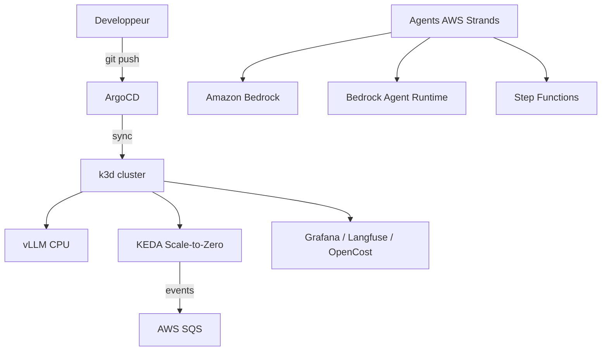

# Architecture

> À compléter avec un schéma (ex: Excalidraw / Mermaid) dès la fin du Sprint 1.

## Flux global (CŒUR)
```
Développeur
   │  git push (manifests)
   ▼
GitOps (ArgoCD)
   │  sync automatique
   ▼
Kubernetes (k3d local, 0$)
   ├── vLLM (CPU) ── inférence LLM privé
   ├── KEDA ── Scale-to-Zero piloté par AWS SQS
   └── Observabilité: Grafana + Langfuse + OpenCost
   
Moteur d'agents (AWS)
   ├── Cas A: Bedrock Agent Runtime  (agents autonomes, AWS Strands)
   ├── Cas B: Step Functions         (flux séquentiel auditable)
   └── Modèle: Amazon Bedrock (Claude / etc.)
```

## Diagramme Mermaid (brouillon)

