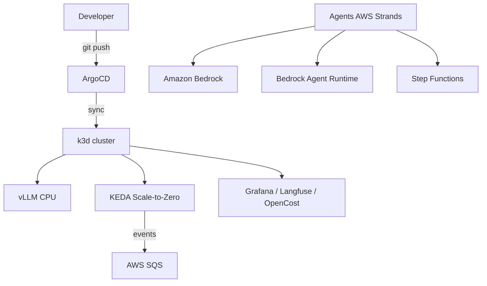

# Architecture

## Global Flow (Core)
```
Developer
   │  git push (manifests)
   ▼
GitOps (ArgoCD)
   │  automatic sync
   ▼
Kubernetes (k3d local, $0)
   ├── vLLM (CPU) ── private LLM inference
   ├── KEDA ── Scale-to-Zero driven by AWS SQS
   └── Observability: Grafana + Langfuse + OpenCost
   
AI Agent Engine (AWS)
   ├── Case A: Bedrock Agent Runtime  (autonomous agents, AWS Strands)
   ├── Case B: Step Functions         (auditable sequential flows)
   └── Model: Amazon Bedrock (Claude / etc.)
```

## Mermaid Diagram

```mermaid
flowchart TD
    Dev[Developer] -->|git push| Argo[ArgoCD]
    Argo -->|sync| K8s[k3d cluster]
    K8s --> vLLM[vLLM CPU]
    K8s --> KEDA[KEDA Scale-to-Zero]
    KEDA -->|events| SQS[AWS SQS]
    K8s --> Obs[Grafana / Langfuse / OpenCost]
    Agents[Agents AWS Strands] --> Bedrock[Amazon Bedrock]
    Agents --> CasA[Bedrock Agent Runtime]
    Agents --> CasB[Step Functions]
```

## Two-Tier App-of-Apps

```
Terraform (Terragrunt)
  └─ k3d cluster + ArgoCD install + parent Application
       └─ Parent App "aipaas-apps" scans apps/*/application.yaml
            └─ Child Apps created automatically
                 ├── Git path apps  → render raw manifests (vllm, test-nginx)
                 └── Helm chart apps → pull chart + apply inline values (keda, grafana, etc.)
```

## Node Topology

```
k3d-aipaas-server-0  (3g, control-plane)
  ├── taint: Addons-Services=true:NoSchedule
  └── runs: ArgoCD server, controller, repo-server, redis

k3d-aipaas-agent-0  (6g, worker)
  └── runs: all application workloads (vLLM, Grafana, Prometheus, etc.)
```
